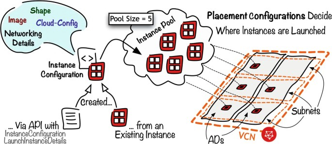
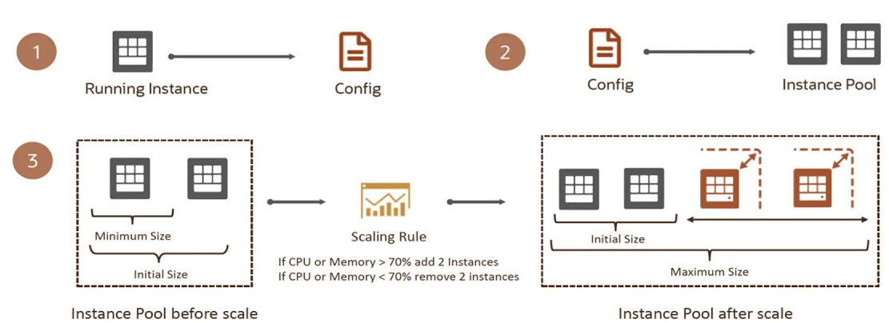
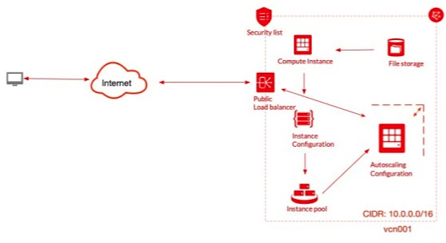

# OCI Instance Pool Operations Automation Module

This terraform module provides a terraform automation for automating the operations that imply OCI instance pool, instance configuration and autoscaling.

It supports a highly configurable input set of parameters for provisioning OCI instance pool, instance configuration and autoscaling in different topologies and configurations. 

The input parameters, by using `*.auto.tfvars`, support a large variety of configurations and topologies without the need for the user to touch the `*.tf` files.

## Provisioned configuration


The automation provisions an instance pool toghether with the instance configuration and the autoscaling configuration, which are atributes of the instance pool.

 

**Image source:** ***Patterns for Compute and Networking - Michał Tomasz Jakóbczyk***

To the instance pool you can add the auto scaling configuration which will enable the number of pool nodes to go up or down based of some defined rules.

 

Optionally, an integration between the instance pool autoscaling configuration and a load balancer can be defined. By defining this integration all the compute nodes in the instance pool will be added as backend servers to an LB defined backend set. Whenever the auto scaling feature will scale up or down the compute nodes in the instance pool, auto scaling will also update the backend set by adding or removing coresponding backend servers.

 

***Example:***

Bellow you can see the input complex parameter for provisioning an instance pool with an instance configuration and an autoscaling configuration. A load balancer integration is also define.

To provision such a topology, the needed input in the ```*.auto.tfvars``` is:

```
instance_pool_config = {
  default_compartment_id = "ocid1.compartment.oc1..aaaaaaaawwhpzd5kxd7dcd56kiuuxeaa46icb44cnu7osq3mbclo2pnv3dpq"
  default_defined_tags   = {}
  default_freeform_tags  = null

  instance_pool = {
    compartment_id = null
    size           = 1
    defined_tags   = {}
    freeform_tags  = null
    display_name   = "cotud_inst_pool"

    # required
    placements_configurations = {
      # required
      ad = "NoEK:EU-FRANKFURT-1-AD-1"
      # optional
      fd = null
      # required
      primary_subnet_id = "ocid1.subnet.oc1.eu-frankfurt-1.aaaaaaaaxrvqkn3sd4bxzlhpyn2aaw7puroolcwodh3t5wpyb5sowt27baaq"
      #optional
      secondary_vnic_subnets = {}
    }

    # optional

    load_balancers = {
      lb_1 = {
        load_balancer_id = "ocid1.loadbalancer.oc1.eu-frankfurt-1.aaaaaaaalfxiresfyeh2wp6q36ewdwxougpj4kyyqobjqrhaaneiwm4up5kq"
        backend_set_name = "cotud_inst_pool"
        port             = "80"
        vnic_selection   = "PrimaryVnic"
      }
    }

    instance_configuration = {
      # required
      compartment_id = null

      #optional 
      defined_tags  = {}
      freeform_tags = null
      display_name  = "cotud_inst_config"

      # optional - Default = NONE; Values = ["NONE, INSTANCE"]
      source = "NONE"
      # Required when source=INSTANCE
      instance_id = null
      # required 
      instance_details = {

        # required - The type of instance details. Supported instanceType is compute
        instance_type = "compute"

        # optional
        block_volumes = {}

        # optional
        launch_details = {
          # optional
          ad = "NoEK:EU-FRANKFURT-1-AD-1"
          # optional
          fd = null
          # optional
          capacity_reservation_id = null
          # optional
          compartment_id = null
          # optional
          dedicated_vm_host_id = null
          # optional
          defined_tags = {}
          # optional
          freeform_tags = null
          # optional
          display_name = "cotud_launch_details"
          # optional
          extended_metadata = null
          # optional
          ipxe_script = null
          # optional
          is_pv_encryption_in_transit_enabled = false
          # optional value in [NATIVE, EMULATED, PARAVIRTUALIZED, CUSTOM]
          launch_mode = "NATIVE"
          # optional
          ssh_public_key_path = "/Users/cotudor/my_ssh_keys/cos_key.pub"
          # optional - value in [LIVE_MIGRATE, REBOOT] - default = LIVE_MIGRATE
          preferred_maintenance_action = "LIVE_MIGRATE"
          # optional
          shape = "VM.Standard2.1"
          # optional
          agent_config = null
          # optional
          availability_config = null

          create_vnic_details = {
            # optional
            assign_private_dns_record = false
            # optional
            assign_public_ip = true
            # optional
            defined_tags = {}
            # optional
            freeform_tags = null
            # optional
            display_name = "cotud_instpool_vnic1"
            # optional
            hostname_label = "cotudinstpoll",
            # optional 
            nsg_ids = null
            # optional
            private_ip = null
            # optional
            skip_source_dest_check = true
            # optional
            subnet_id = "ocid1.subnet.oc1.eu-frankfurt-1.aaaaaaaaxrvqkn3sd4bxzlhpyn2aaw7puroolcwodh3t5wpyb5sowt27baaq"
          }

          # optional
          instance_options = null

          # optional
          launch_options = null
          # optional
          platform_config = null

          # optional
          preemptible_instance_config = null

          # optional
          shape_config = null

          # optionals
          source_details = {

            # required - value in [bootvolume, image]
            source_type = "image"
            # optional - Applicable when source_type=bootVolume
            boot_volume_id = null
            # optional - Applicable when source_type=image
            boot_volume_size_in_gbs = 50
            # optional -  Applicable when source_type=image
            image_id = "ocid1.image.oc1.eu-frankfurt-1.aaaaaaaawq2h5g4nb6odpdt3rwyvp7bx26fv5pyjpbwzlwnybztss34vuz2q"
          }


        }

        # optional
        secondary_vnics = {}
      }

    }

    # optional
    auto_scaling_configuration = {
      auto_scaling_resources = {
        # resource type
        type = "instancePool"
      }
      # required
      compartment_id = null

      #Optional
      cool_down_in_seconds = 300
      defined_tags         = null
      display_name         = "cotud_auto_scaling"
      freeform_tags        = null
      is_enabled           = true

      # required
      policies = {
        # Required value in [scheduled, threshold]
        policy_type = "threshold"
        # optional 
        capacity = {
          #Optional
          initial = 1
          max     = 5
          min     = 1
        }
        # optional 
        display_name = "cotud_auto_scaling_policy"
        # required when policy_type=scheduled
        execution_schedule = null
        # optional
        is_enabled = true
        # required when policy_type=scheduled
        resource_action = null
        # required 
        rules = {
          cotud_rule_1_scale_out = {

            # required 
            action = {

              # required 
              type = "CHANGE_COUNT_BY"
              # required
              value = 1
            }

            # Required 
            display_name = "cotud_rule_1_scale_out"

            # Required when policy_type=threshold
            metric = {

              # Required when policy_type=threshold
              metric_type = "CPU_UTILIZATION"
              # Required when policy_type=threshold
              threshold = {

                # Required when policy_type=threshold
                operator = "GT"
                # Required when policy_type=threshold
                value = "70"
              }
            }
          }

          cotud_rule_1_scale_in = {
            # required 
            action = {

              # required 
              type = "CHANGE_COUNT_BY"
              # required 
              value = -1
            }

            # Required 
            display_name = "cotud_rule_1_scale_out"

            # Required when policy_type=threshold
            metric = {

              # Required when policy_type=threshold
              metric_type = "CPU_UTILIZATION"
              # Required when policy_type=threshold
              threshold = {

                # Required when policy_type=threshold
                operator = "LT"
                # Required when policy_type=threshold
                value = "50"
              }
            }
          }
        }
      }
    }
  }
}
```

As one can notice the only file that needs to be editated in ```*.auto.tfvars``` and not a ```*.tf``` file.

### Outputs

 - This module is returning both an hierarchical and a flat structure of the:
    - Instance Pool
    - Instance Configuration
    - Autoscaling configuration

that has been provisioned.

We're exposing both versions as flat is easy to consume by other automations where hierarchical is easy to read by end user.

## How to use this module

- Under the module examples folder you'll find 1 sub-folder
    - ```SimplerInstancePool```


- Whenever you need to create a new instance pool configuration you can just copy the ```SimpleInstancePool``` folder and edit the ```instance_pool.auto.tfvars```. Inside your copy of ```SimpleInstancePool``` folder you can make a copy of ```terraform.tfvars.template``` to ```terraform.tfvars``` and edit the ```terraform.tfvars``` to provide your OCI credentials.

- More information about how to use examples will be found in the specific example folder ```README.md``` files:
  - Simple Instance Pool [README.md](examples/SimpleInstancePool/README.md).


## Notes/Issues

- Please note that we are curently facing a bug with the operation of removing/updating an attached load balancer.

## Versions

This module has been developed and tested by running terraform on macOS Monterey Version 12.2.1 

```
$ terraform --version
Terraform v1.1.3
on darwin_amd64
+ provider registry.terraform.io/hashicorp/oci v4.64.0
+ provider registry.terraform.io/hashicorp/time v0.7.2

Your version of Terraform is out of date! The latest version
is 1.1.7. You can update by downloading from https://www.terraform.io/downloads.html

```

## Contributing

This project is open source. Oracle appreciates any contributions that are made by the open source community.

## License

Copyright (c) 2022, Oracle and/or its affiliates.

Licensed under the Universal Permissive License v 1.0 as shown at https://oss.oracle.com/licenses/upl.

See [LICENSE](LICENSE) for more details.